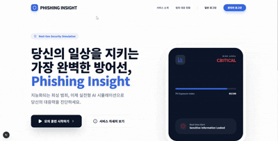
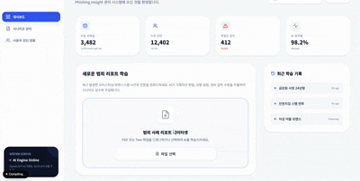

# Phishing Insight
### AI 기반 실전형 피싱 시뮬레이션 및 행동 진단 플랫폼

>Phishing Insight는 실제 보이스피싱 피해 사례를 기반으로 AI가 범죄자를 모사하고 사용자의 대응 행동을 분석하는 **행동 중심 예방 교육 서비스**입니다.

 

---

## 🚨 Problem

- 피싱은 정보 부족이 아니라 **심리적 압박 상황에서의 행동 실패 문제**
- 정적 교육 방식은 실제 범죄의 단계적 압박 구조를 재현하지 못함
- 최신 수법 변화에 대응하기 어려운 기존 콘텐츠 구조

 

---

## 💡 Solution

- 실제 금융감독원 공개 피해 사례 기반 시뮬레이션
- LLM 기반 적응형 대화 구조
- 룰 기반 판단 엔진을 통한 행동 분석
- 개인별 취약 트리거 진단 리포트 제공

 

---

## 🧠 System View

 

---

## 👥 User Flow

<table>
  <tr>
    <th align="center">🔹 일반 사용자</th>
    <th align="center">🔹 관리자</th>
  </tr>
  <tr>
    <td>
      1. 시뮬레이션 참여 
      2. 자유 대화 진행 
      3. 위험 행동 발생 
      4. 진단 리포트 확인
    </td>
    <td>
      1. 사례 데이터 업로드 
      2. 카테고라이징 및 룰 정의 
      3. 시나리오 반영 
      4. 운영 모니터링
    </td>
  </tr>
</table>

 

---

## 🎥 Demo

<table>
  <tr>
    <td align="center">
      <b>사용자 시뮬레이션 화면</b> 
      
    </td>
    <td align="center">
      <b>관리자 화면</b> 
      
    </td>
  </tr>
</table>

- 전체 데모 영상:  👉 [유튜브 바로가기](https://youtu.be/GVYhEuwNFKo?si=2JQ7XJ3UanHRDqNZ)

 

---

## ⚙️ Tech Stack (MVP 기준)

- **Frontend**: Next.js
- **LLM API**: 시뮬레이션 대화 생성 및 로그 요약
- **RAG 구조**: 사례 카테고라이징 기반 데이터 조회
- **Rule Engine**: 위험 판단 및 종료 조건 처리

> AI 의존도를 최소화하고 통제 가능한 구조로 설계되었습니다.

 

---

## 🚀 Future Expansion

- 음성 기반 통화 시뮬레이션 (멀티모달 확장)
- 금융 앱 연계 사전 위험 진단 API
- 고위험군 맞춤 시나리오 제공
- 누적 데이터 기반 취약 패턴 고도화

 

---

## 📎 Project Purpose

SAFECHOICE는 단순히 피싱을 “알려주는” 서비스가 아니라,  
**피싱을 직접 경험하게 만들어 행동을 바꾸는 예방 플랫폼**을 목표로 합니다.
